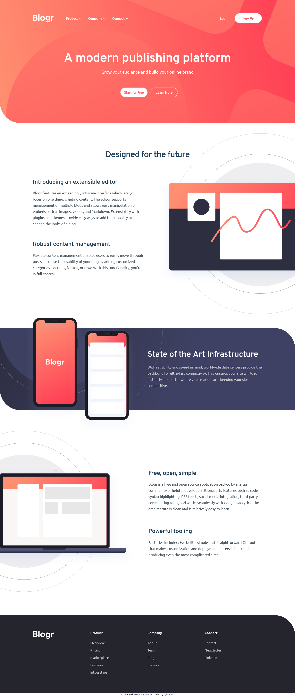

# Frontend Mentor - Blogr landing page solution

This is a solution to the [Blogr landing page challenge on Frontend Mentor](https://www.frontendmentor.io/challenges/blogr-landing-page-EX2RLAApP). Frontend Mentor challenges help you improve your coding skills by building realistic projects.

## Table of contents

-   [Overview](#overview)
    -   [The challenge](#the-challenge)
    -   [Screenshot](#screenshot)
    -   [Links](#links)
-   [My process](#my-process)
    -   [Built with](#built-with)
    -   [What I learned](#what-i-learned)
    -   [Continued development](#continued-development)
    -   [Useful resources](#useful-resources)
-   [Author](#author)

## Overview

### The challenge

Users should be able to:

-   View the optimal layout for the site depending on their device's screen size
-   See hover states for all interactive elements on the page

### Screenshot

### Links

-   Solution URL: [Github Repo](https://github.com/kyle4real/Blogr-Landing-Page.git)
-   Live Site URL: [Github Pages](https://kyle4real.github.io/Blogr-Landing-Page/)

## My process

### Built with

-   Semantic HTML5 markup
-   CSS custom properties
-   Flexbox
-   CSS Grid
-   Mobile-first workflow
-   Javascript

### What I learned

Use this section to recap over some of your major learnings while working through this project. Writing these out and providing code samples of areas you want to highlight is a great way to reinforce your own knowledge.

I learned best practices for full website projects.
I learned about CSS Grid and how useful it's grid-template-area can be.
I learned about implementing stunning menus and dropdowns using a combination of javascript and css.
I learned that you can easily use loops and event listeners in unison.
I learned that I hate trying to make elements with absolute position responsive.

### Continued development

I want to continue developing on my javascript and css knowledge so I can implement more features.

### Useful resources

-   [mdn](https://developer.mozilla.org/en-US/docs/Web/API/EventTarget/addEventListener) - This helped me to implement event listeners.
-   [w3school](https://www.w3schools.com/jsref/prop_element_firstelementchild.asp) - This helped me to find out how to access the child node of an element so that I could make the chevrons function properly.

## Author

-   Website - [Kyle Friel](https://github.com/kyle4real)
-   Frontend Mentor - [@kyle4real](https://www.frontendmentor.io/profile/kyle4real)
